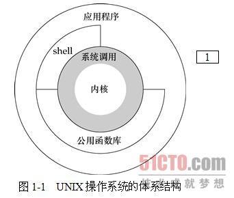

*************************************************************
- 《UNIX环境高级编程(第三版)》学习日志
- 作者：谢荣桢
- 版本：V1.0
*************************************************************

## [0.0.1](#第一章) (2018-10-29 22:51)
# 第一章 UNIX基础知识
## 1.1 引言
&emsp;　典型的服务：执行新程序、打开文件、读文件、分配存储区以及获得当前时间等

## 1.2 UNIX体系结构
&emsp;　**内核(kernel)：** 一种软件，控制计算机硬件资源，提供程序运行环境。
&emsp;　**系统调用(system call)：** 内核的接口
&emsp;　**公用函数库：** 在系统调用接口之上。
&emsp;　**shell：** 一个特殊的应用程序，为运行其他应用程序提供了一个接口。

## 1.3 登录
### 1.登录名
&emsp;　用户在登录UNIX系统时，先键入登录名，然后键入口令。
&emsp;　系统在其口令文件(通常在/etc/passwd文件)中查看登录名。
&emsp;　**口令文件中的登录项组成(用冒号分隔)：** 登录名、加密口令、数字用户ID(205)、数字组ID(105)、注释字段、起始目录(/home/sar)、shell程序(/bin/ksh)。

    例：sar:x:205:105:Stephen Rago:/home/sar:/bin/ksh

注：目前所有的系统已将加密口令移到[另一个文件中](#第六章)

### 2.shell</sapn>
&emsp;　shell是一个命令行解释器，读取用户输入，然后执行命令。
&emsp;　常见的的shell：Bourne shell、Bourne-again shell、C shell、Korn shell、TENEX C shell。
&emsp;　系统从口令文件中相应用户*登录项的最后一个字段*(bin/ksh)中了解到应该为该登录用户执行哪一个shell。
## 1.4 文件和目录</sapn>
### 1.文件系统</sapn>
&emsp;　UNIX文件系统时目录和文件的一种层次结构，所有东西的起点是称为 **根(root)** 的目录，其名称是一个字符"/"。
&emsp;　**目录(directory)** 是一个包含目录项的文件。
&emsp;　在逻辑上，可以认为每个目录项都包含一个文件名，同时还包含说明该文件属性的信息。
&emsp;　**文件属性：** 文件类型(普通文件还是目录等)、文件大小、文件所有者、文件权限(其他用户能否访问该文件)、文件最后的修改时间。
&emsp;　stat和fstat函数返回包含所有文件属性的一个信息结构。文件属性详见[第四章](#第四章)
### 2.文件名(filename)</sapn>
&emsp;　只有斜线(/)和空字符不能出现在文件名中。
&emsp;　**斜线：** 分隔构成路径名的各文件名
&emsp;　**空字符：** 用来终止一个路径名。

### 3.路径名
&emsp;　**路径名(pathname)：** 有斜线分隔的一个或多个文件名组成的序列(也可以斜线开头)
&emsp;　**绝对路径名(absolute pathname)：** 以斜线开头的路径名称。
&emsp;　**相对路径名(relative pathname)：** 指向相对于当前目录的文件(不以斜线开头)。
&emsp;　例题：myls.c
&emsp;　**细节：**
- apue.h：包含了某些标准系统头文件，定义了许多常量及函数原型
- dirent.h：使用opendir和readdir的函数原型，以及dirent结构的定义
- main函数的声明使用了[ISO C标准](#第二章)所使用的风格。
- 程序获取命令行的第一个参数argv[1]作为要列出其各个目录项的目录名。[第七章](#第七章)说明main函数调用以及程序存取命令行参数和环境变量。
- 由于各种不同的UNIX系统目录项的实际格式不一样，所以使用函数opendir、readdir和closedir对目录进行处理
- opendir函数返回指向DIR结构的指针，将该指针传送给readdir函数。
- readdir返回一个指向dirent结构的指针，而当目录中已无目录项可读时则返回null指针。
- 在dirent结构中取出的只是每个目录项的名字(d_name)。使用该名字，可调用[stat函数](#4.2)以获得该文件的所有属性。
- 程序调用了两个自编的函数对错误进行处理：err_sys和err_quit。[1.7节叙述出错处理](#1.7)。
- 当程序结束时，以参数0调用函数eixt。表示正常结束。[8.5节](#8.5)将说明一个程序如何获得它所执行的另一个程序的exit状态。

### 4.工作目录(working directory)
&emsp;　所有相对路径名都从工作目录开始解释。进程用chdir函数更改其工作目录。

### 5.起始目录(home directory)
&emsp;　登录时，工作目录设置为起始目录，该起始目录从[口令文件](#1.3)中相应用户的登录项中取得。

## 1.5 输入和输出
### 1.文件描述符(file descriptor)
&emsp;　一个很小的非负整数，内核用以标识一个特定进程正在访问的文件。
&emsp;　当内核打开一个现有文件或创建一个新文件时，都返回一个文件描述符。
&emsp;　在读、写文件时，可以使用这个文件描述符。

### 2.标准输入、标准输出和标准错误
&emsp;　每当运行一个新程序时，所有的shell都为其打开三个文件描述符：**标准输入(standard input)、标准输出(standard output)、标准错误(standard error)**。
&emsp;　大多数shell都提供一种方法，使其中任何一个或所有这3个描述符都能重新定向到某个文件。
&emsp;　例：ls > file.list

    执行ls命令，其标准输出重新定向到名为file.list的文件。
    即运行实例中的命令，结果输出到file.list(如不存在file.list，生成file.list)

### 3.不带缓冲的I/O

&emsp;　函数open、read、write、lseek以及close提供了不带缓冲的I/O。
&emsp;　例：mycat.c

- 头文件<unistd.h>(apue.h包含了此头文件)及两个常量STDIN_FILENO和STDOUT_FILENO是[POSIX标准](#第二章)的一部分。头文件<unistd.h>包含了很多UNIX系统服务的函数原型。
- STDIN_FILENO和STDOUT_FILENO指定了标准输入和标准输出的文件描述符。在POSIX标准中，它们的值分别是0和1.
- [3.9节](#3.9)将详细讨论BUFFSIZE常量，说明它的各种不同值将如何影响程序的效率。不管BUFFSIZE值如何，mycat.c总能复制任一UNIX普通文件。
- read函数返回读取的字节数，此值用作要写的字节数。
- ./a.out > data 标准输入为终端，标准输出重定向至文件data，标准错误也是终端。程序将用户键入的各行复制到data，键入文件结束符(通常是Ctrl+D)，结束复制。
- ./a.out < infile > outfile 将名为infile文件的内容复制到outfile文件(若infile不存在，会报错)
- [第三章](#第三章)将详细说明不到缓冲的I/O函数。

### 4.标准I/O
&emsp;　标准I/O为不带缓冲的I/O函数提供了一个带缓冲的接口。
&emsp;　[5.4节](#5.4)：标准I/O函数库提供控制该库所使用的缓冲风格的函数。
&emsp;　例：getcputc.c
